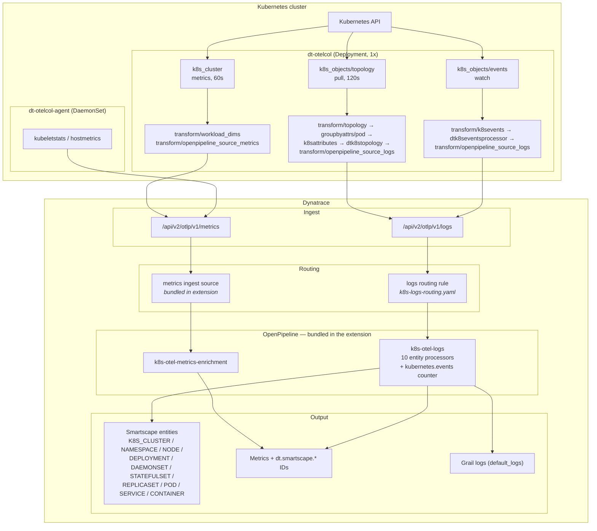
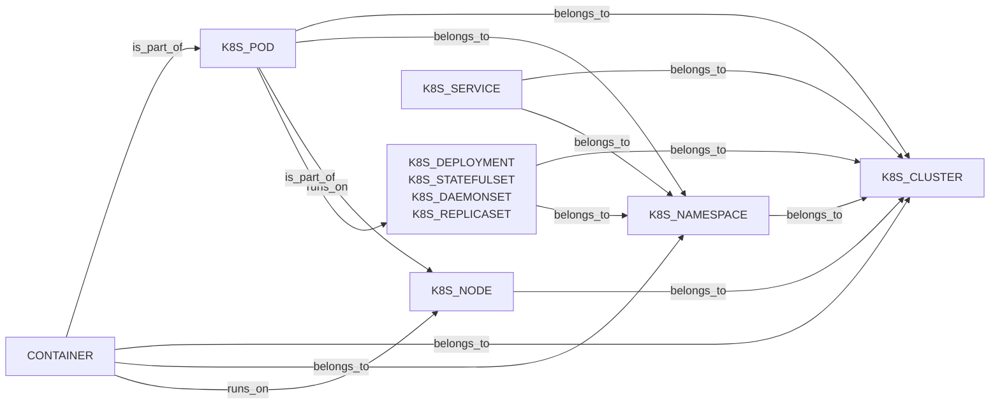

# dt-otelcol-k8s — Architecture

How Kubernetes telemetry gets from the cluster into Dynatrace Smartscape entities.

> [!WARNING]
> **Known issue — the logs ingest source does not work.**
>
> The intended design was for both signals to route statically off ingest
> sources bundled in the extension, with no routing rules at all. That works for
> metrics. It does **not** work for logs.
>
> `dt.openpipeline.source` is assigned server-side from the ingest path, so an
> `extension`-type ingest source only claims data delivered through the
> extension execution path (EEC). This collector pushes straight to
> `/api/v2/otlp/v1/logs`, so its logs land on the built-in OTLP source and the
> extension's source never matches them.
>
> The failure is **silent**: the source installs, reports `enabled: true`, and
> matches nothing. Records sit in `logs:default`, no entities are created, and
> no error is raised anywhere.
>
> **Workaround — a custom dynamic routing configuration.**
> `openpipeline/k8s-logs-routing.yaml` is applied separately with `dtctl` and
> routes logs to the bundled pipeline by rule. No logs ingest source is shipped
> in the extension, deliberately, so nothing implies routing that does not
> happen.
>
> Cost of the workaround: the rule references the pipeline by **`objectId`**
> rather than `customId`, so it must be re-resolved whenever the extension is
> installed into a different environment — reintroducing exactly the manual step
> that bundling was meant to eliminate.
>
> Tracked as a platform request: OpenPipeline should let extension ingest
> sources claim OTLP-pushed data.

## Overview



The diagram shows the live path only. Two things deliberately left out: the
`k8s-otel-metrics-extraction` pipeline, which ships in the extension but is not
routed by default (see [Metrics modes](#metrics-modes)), and the logs ingest
source, which is not shipped at all (see the Known issue above).

## The routing asymmetry

The two signals reach their pipelines by different mechanisms. Metrics use the
intended design; logs use the workaround described in the Known issue above.

| | Metrics ✅ | Logs ⚠️ |
|---|---|---|
| Mechanism | ingest source bundled in the extension | **custom dynamic routing rule**, applied with `dtctl` |
| Matches on | `dt.openpipeline.source` claimed by the source | rule matcher reading `dt.openpipeline.source` |
| References pipeline by | `customId` — stable | `objectId` — must be re-resolved per environment |
| Lives in | `extension/src/openpipeline/metrics.source.json` | `openpipeline/k8s-logs-routing.yaml` |
| Ships with the extension | yes | no — separate apply step |

The collector still stamps `dt.openpipeline.source` on logs — not because an
ingest source can use it, but because the *routing rule* matches on it. That
keeps the rule tied to the extension identity instead of enumerating
`event.provider` values, so new providers route without editing the rule.

### Evidence

Three variants were tried against a live tenant before settling on the rule.
All left records in `logs:default`:

| Attempt | `dt.openpipeline.source` sent | Result |
|---|---|---|
| 1 | `custom:dt-k8s-otel-topology` | `logs:default` |
| 2 | `extension:custom:dt-k8s-otel-topology` | `logs:default` |
| 3 | bare name + `dt.event.route_to_openpipeline: "true"` | `logs:default` |

The `extension:` prefix is a red herring — DT prepends it to every extension's
**logs-scope** source on store and to no other scope, so it was never ours to
get wrong.

To check which path a record took:
```dql
fetch logs, from:now()-5m | filter event.provider == "KUBERNETES_OTEL_TOPO"
| summarize cnt=count(), by:{dt.openpipeline.pipelines}
```
`logs:k8s-otel-logs` means the workaround is working; `logs:default` means it is
not.

## Metrics modes

The metrics ingest source targets `k8s-otel-metrics-enrichment` by default.
Both changes below are edits to that one settings object in Dynatrace — no
redeploy, no extension rebuild:

- **Enrichment (default)** — attaches `dt.smartscape.*` IDs to data points.
  Entity creation is the logs pipeline's job.
- **Extraction** — repoint `staticRouting.pipelineId` at
  `k8s-otel-metrics-extraction` to create entities from metrics too. Useful when
  the topology pull is unavailable, or to cover the 120s gap between pulls.
- **Off** — set `enabled: false`.

## Entity model



Entity IDs are derived from `idComponents` — changing those changes every ID, so
they must stay identical across the logs and metrics pipelines or the same
object would produce two entities.

`CONTAINER` is the native Dynatrace type, not a custom one. `k8s.object` (the
full serialized API object) is extracted for every type except `CONTAINER` and
`K8S_CLUSTER`, neither of which has an underlying API object.

## Deployment shape

- **Deployment (1 replica)** — cluster-scoped collection: `k8s_cluster` metrics,
  topology pull, event watch. Single instance to avoid duplicate topology.
- **DaemonSet** — per-node `kubeletstats`; a second DaemonSet handles host
  metrics.
- **Two tokens** — metrics use a classic API token, logs a platform token
  (see `docs/TOKEN_WORKAROUND.md`).

`groupbyattrs/pod` before `k8sattributes` is load-bearing: `k8s_objects` pull
mode batches every pod in a namespace into one `ResourceLogs`, so without the
split all pods in a namespace inherit the last pod's workload metadata.
